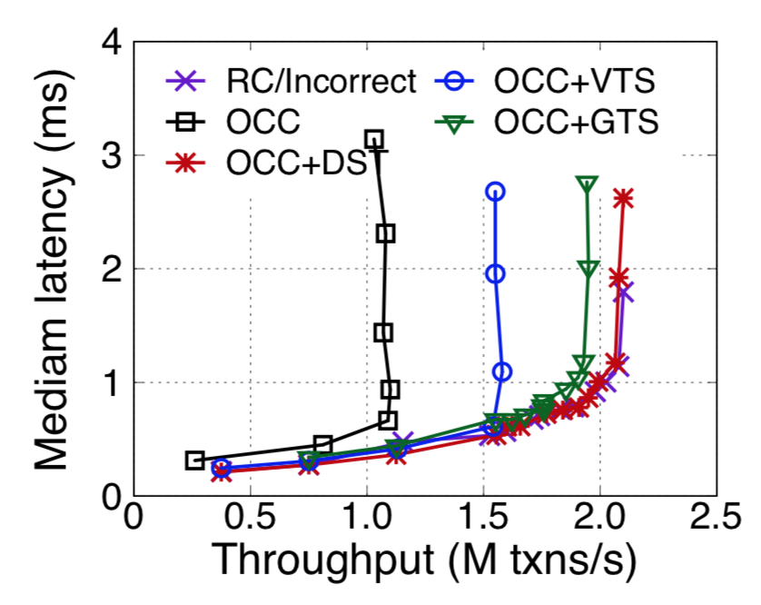

# DrTM + DST

DrTM uses optimistic concurrency control (OCC) for transactions.
Using OCC for transactions is sub-optimal. 
For example, at a high level, the read-only transactions executes in two-rounds:
the first round execute transaction's logic,
the second round validates whether the first round's results has been changed or not.
If the second round validation failes, the transactions are aborted and will retry.
The additional round of validation takes extra network round-trip,
while the abort of a long running transaction will causes significant performance degradations.
DST improves the performance of read-only transactions in OCC by avoids the second round
of validation, and aborts of read-only transactions using MVCC.

## Experimental setup

The original DrTM is designed to run on fast and new network primitive (RDMA).
We extend it to run on both RDMA and traditional network (TCP/IP).
We use two cluster,
one with RDMA (VALR) and one without RDMA (VALR).
Both cluster shares the same CPU and memory settings:
each server has 16 cores and 128GB memory.
For traditional network, each server is equipped with a 10Gbps Ethernet card.
For RDMA network, each server has two Mellanox CX4 100Gbps cards.

We compare DST with DrTM's OCC, and other timestamp baselines.
GTS uses a global timestamp oracle for version management.
VTS uses per-worker (coordinator) timestamp, which is more scalable than GTS.
GTS, VTS and DST provide the same isolation level: serializability.

We further use three representative workloads: TPC-E, TPC-C and Smallbank,
which is the standard benchmarks for OLTP workloads.

## Detailed results, note that we report the peak throughput.

Results on TCP network:

| Concurrency control protocols      | TPC-E | TPC-C              | Smallbank          |
| ------------------------------ | ------------------:| ------------------:| ------------------:|
| OCC (baseline)     |130,224 reqs/sec |1,604,823 reqs/sec |42,915,700 reqs/sec |
| OCC + DST |237,666 reqs/sec |1,614,940 reqs/sec |42,924,320 reqs/sec |
| OCC + GTS |269,167 reqs/sec |728,463 reqs/sec   |1,392,530  reqs/sec |
| OCC + VTS |209,498 reqs/sec |961,231 reqs/sec   |2,951,770  reqs/sec |

Results on RDMA network:

| Concurrency control protocols      | TPC-E | TPC-C              | Smallbank          |
| ------------------------------ | ------------------:| ------------------:| ------------------:|
| OCC (baseline)     | 1,036,073 reqs/sec |10,319.640  reqs/sec |101,536,000 reqs/sec |
| OCC + DST |2,066,246 reqs/sec |10,882,500 reqs/sec |102,307,000 reqs/sec |
| OCC + GTS |1,929,320 reqs/sec |2,587,344 reqs/sec   |2,595,130  reqs/sec |
| OCC + VTS |1,584,770 reqs/sec |9,146,606 reqs/sec   |43,499,300  reqs/sec | 

 