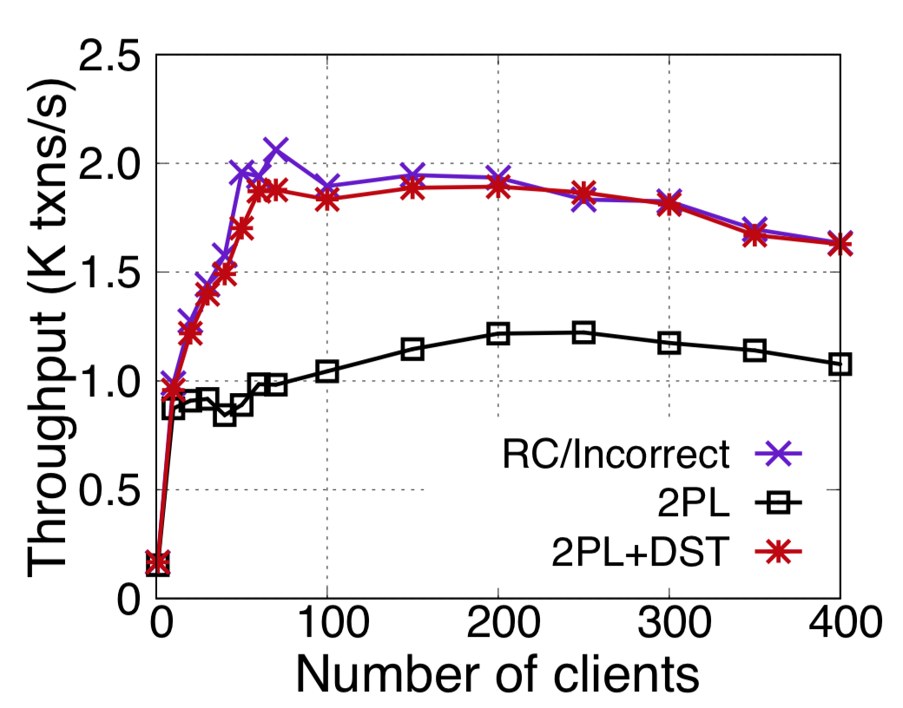

# MySQL cluster + DST

At a high level, original MySQL cluster use *per-low two-phase locking (2PL)* for concurrency control.
For locking based databases, reader and writer blocks each other, yields worser performance.
MySQL cluster in default uses *read-committed (RC)* for all its reads,
such that reader reads the latest committed value without locking.
However, RC cannot guarantee transactional isolation for readers.
DST can return a transactional isolation for readers without locks.

## Experimental setup

The experiments were executed on a local cluster with 16 machines.
The clients and servers are on different machines.
We use 10 databases partitions, each is 2-way replicated.
- **TPC-C**. Each database partition holds one warehouse.
- **Smallbank**. Each database partition holds 100000 user accounts.

## Detailed results:

We compare DST with the original concurrency control of MySQL cluster (2PL) and RC.
Below is the more detailed results.
We varied the number of clients until the performance at the server is saturated,
and we report the peak throughput of each concurrency control protocol.

| Concurrency control protocols      | TPC-C              | Smallbank          |
| ------------------------------ | ------------------:| ------------------:|
| 2PL[1](#myfootnote0) (strict serializability)   | 1222.89 reqs/sec                | 14811.12 reqs/sec         |
| DST (serializability)          |     1892.98 reqs/sec                      |  18970.87 reqs/sec
| RC[2](#myfootnote1)  (Non-serializable)         | 2062.82 reqs/sec                | 19463.62 reqs/sec              |

<a name="myfootnote0">1</a>: 2PL states for 2-phase-locking. This is the original concurrency control protocol
used in MySQL cluster.

<a name="myfootnote1">2</a>: RC(Read committed) isolation level.
 