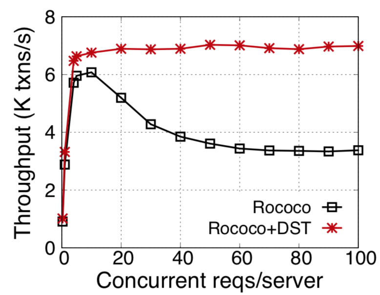

# ROCOCO + DST

At a high level, original ROCOCO uses different protocols to handle read-write
transactions and read-only transactions.
For read-write transactions, ROCOCO reorders conflicting transactions to avoid
overhead due to contentions in traditional concurrency control,
(i.e. reties in optimistic concurrency control).
However, it optimistically executes read-only transactions, similar to optimistic concurrency control.
It will first execute transactions optimistically,
and validate until success.
So that under high contention, ROCOCO's read-only transaction may frequently abort.
With DST, ROCOCO's read-only transaction executes in exact one round-trip, and never aborts.

## Experimental setup
The experiments were executed on a local cluster with 16 machines.
The clients and servers are on different machines.
We use the same client-server ratio and the same, **scaled distributed sharded TPC-C**
as the evaluations in original ROCOCO [paper](https://www.usenix.org/system/files/conference/osdi14/osdi14-paper-mu.pdf).

## Detailed results:

| Concurrency control protocols      | TPC-C  new-order throughput (high contention)           |  Stock-level latency |
| ------------------------------     | ------------------:| -----:|
| ROCOCO          |     3378K reqs/sec | 195 ms | 
| ROCOCO + DST          |     6986K reqs/sec | 18 ms|
 